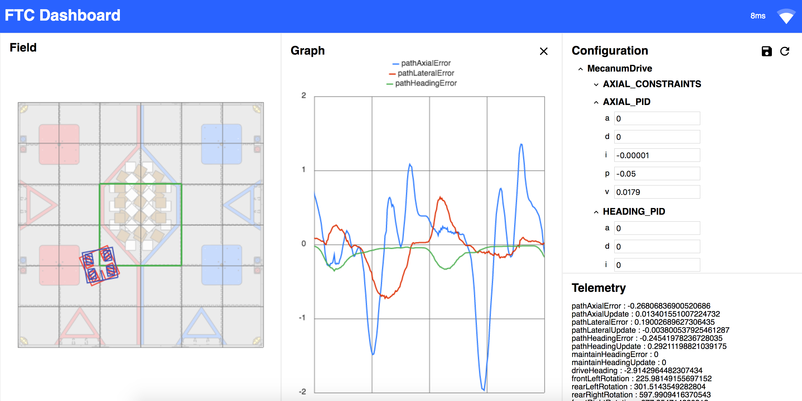

# Github Instructions

1. Go to android studio and click the blue arrow in the top right of the screen
2. Make whatever edits you want
3. Click the blue arrow again
4. Resolve any conflicts
5. Click the green check mark next to the blue arrow
6. Make commit message your name and the date

FTC Dashboard is a web app for monitoring FTC robots during operation with the following features:

* Telemetry with plots and field graphics
* Live configuration variables
* Camera streaming
* Limited op mode controls and gamepad support

Check out our [online documentation](https://acmerobotics.github.io/ftc-dashboard).

